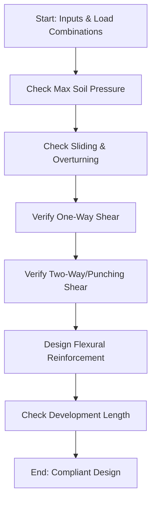

# Spread Footing Design Requirements

This document outlines the engineering parameters, load combinations, and design criteria required to perform a code-compliant structural design of a rectangular concrete spread footing.

---

## 1. Input Parameters

To design the footing, the following data must be provided (typically populated in the project's single source of truth `project.json` file):

### 1.1 Applied Service & Factored Loads
These loads are evaluated at the base of the column or pedestal:

*   **Axial Forces ($P$):**
    *   Dead Load ($P_D$): Weight of the structure, finishes, and permanent equipment.
    *   Live Load ($P_L$): Occupancy live loads.
    *   Snow Load ($P_S$): Roof snow loads (where applicable).
    *   Wind/Seismic ($P_W$, $P_E$): Wind or earthquake vertical components.
*   **Bending Moments ($M_x$, $M_y$):**
    *   Overturning/eccentric moments about the major ($x$) and minor ($y$) axes of the footing.
*   **Horizontal Shear ($V_x$, $V_y$):**
    *   Shear forces at the base of the column/pier used for sliding checks.

### 1.2 Geotechnical Parameters
*   **Allowable Soil Bearing Capacity ($q_a$):** Maximum permissible net or gross contact pressure on the soil (typical range: $1,500\text{ psf}$ to $5,000+\text{ psf}$).
*   **Soil Unit Weight ($\gamma_{soil}$):** Weight of the soil overburden (typically $110 - 120\text{ pcf}$).
*   **Surcharge Load ($q_s$):** Any uniform live/dead load surcharge on the ground surface above the footing.
*   **Depth of Footing ($D_f$):** Depth from finished ground level to the bottom of the footing (governed by local frost lines and soil strata).
*   **Groundwater Table Depth:** Distance from grade to groundwater to evaluate buoyancy effects.

### 1.3 Concrete & Reinforcement Material Properties
*   **Concrete Compressive Strength ($f'_c$):** Typically $3,000\text{ psi}$ or $4,000\text{ psi}$.
*   **Reinforcement Yield Strength ($f_y$):** Typically $60,000\text{ psi}$ (Grade 60).
*   **Concrete Cover:** Minimum $3.0\text{ inches}$ for concrete cast against and permanently exposed to earth (per ACI 318).

### 1.4 Initial Dimensions
*   **Column Dimensions ($c_x$, $c_y$):** Cross-sectional dimensions of the column.
*   **Trial Footing Size:**
    *   Width ($B$)
    *   Length ($L$)
    *   Thickness ($T$)

---

## 2. Design & Compliance Checklist

A complete design script must perform the following standard engineering checks:

### 2.1 Soil Bearing Capacity (Service Limit State)
Evaluate soil bearing pressures under service load combinations (ASD):
*   **Concentric Load:** $q = \frac{P}{B \cdot L} + \gamma_{soil} D_f \le q_a$
*   **Eccentric Load (One-Way):** $q = \frac{P}{B \cdot L} \pm \frac{6 M}{B^2 \cdot L}$
    *   If eccentricity $e = M/P > B/6$ (load outside the middle-third kern), partial liftoff occurs; calculate peak pressure accordingly.

### 2.2 Concrete Shear Resistance (Strength Limit State - ACI 318)
Use factored load combinations (LRFD) to calculate design soil pressure $q_u$:
1.  **One-Way (Beam) Shear:**
    *   Check critical section at distance $d$ (effective depth) from the column face.
    *   $\phi V_c \ge V_u$ where $V_c = 2\lambda\sqrt{f'_c} b_w d$.
2.  **Two-Way (Punching) Shear:**
    *   Check critical section perimeter $b_0$ located at $d/2$ from the column face.
    *   $\phi V_c \ge V_u$ where $V_c$ is the minimum of three ACI equations (governed by columns shape and location).

### 2.3 Concrete Flexural Design (Strength Limit State - ACI 318)
*   Calculate design moment $M_u$ at the critical section (face of concrete column or halfway between face and centerline for steel base plates).
*   Determine required steel area $A_s$ using flexural design formulas.
*   Ensure $A_s$ meets minimum temperature/shrinkage reinforcement limits:
    *   $A_{s,min} = 0.0018 b \cdot h$ (for Grade 60 steel).

### 2.4 Reinforcement Detailing
*   Verify development length ($l_d$) of tension bars from the critical section to the edge of the footing (less cover).
*   Ensure bar spacing is within code-allowable limits to control cracking.
