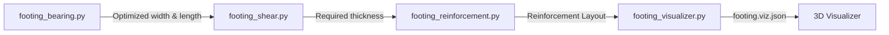

# Required Scripts for Spread Footing Design Workflow

This document outlines the modular Python scripts configured in the `workflow.json` pipeline to perform the automated, code-compliant design of a rectangular concrete spread footing.

---

## 1. Pipeline Sequence

### 1.1 `footing_bearing.py` (ASD Bearing Capacity Check)
*   **Purpose:** Verifies that the footing footprint area ($B \times L$) is sufficient to keep soil contact pressures below the allowable soil bearing capacity ($q_a$) under service load combinations (ASD).
*   **Input Context:** Footing trial dimensions (`width_ft`, `length_ft`, `thickness_in`), depth (`footing_depth_ft`), soil parameters (`soil_unit_weight_pcf`, `allowable_bearing_capacity_psf`), and service loads (`dead_kips`, `live_kips`).
*   **Compliance Check (`aeclib`):** Calculates service bearing pressure (automatically applying a minimum eccentricity for construction tolerances) and compares against the allowable capacity.
*   **Output/Updates:** `soil_bearing_status` (PASS/FAIL), actual maximum bearing pressure, and updated dimensions `width_ft` and `length_ft` (if auto-sizing).

### 1.2 `footing_shear.py` (LRFD Shear Strength Check)
*   **Purpose:** Verifies footing thickness ($T$) against ACI 318 shear requirements (one-way beam shear and two-way punching shear) under factored loads.
*   **Input Context:** Footing dimensions (`width_ft`, `length_ft`, `thickness_in`), concrete cover (`concrete_cover_in`), column sizes (`column_width_in`, `column_length_in`), material strengths (`concrete_strength_psi`), and factored loads.
*   **Compliance Check (`aeclib`):** 
    *   Calculates factored soil bearing pressure $q_u$.
    *   Checks one-way shear capacity ($\phi V_c \ge V_u$) at distance $d$ (effective depth) from the column face.
    *   Checks two-way punching shear capacity ($\phi V_c \ge V_u$) at distance $d/2$ from the column face.
*   **Output/Updates:** `shear_status` (PASS/FAIL) and updated required `thickness_in` (if thickness needs to increase to satisfy shear).

### 1.3 `footing_reinforcement.py` (LRFD Flexure & Detailing)
*   **Purpose:** Designs the bottom reinforcing steel grid in both directions, checks ACI 318 minimum steel ratios, and verifies development length.
*   **Input Context:** Footing dimensions (`width_ft`, `length_ft`, `thickness_in`), concrete cover (`concrete_cover_in`), column sizes, material strengths (`concrete_strength_psi`, `steel_yield_strength_psi`), and factored loads.
*   **Compliance Check (`aeclib`):**
    *   Calculates design bending moment $M_u$ at the critical section (face of the column).
    *   Computes required steel area $A_s$ and determines minimum steel requirements ($A_{s,min} = 0.0018 \cdot b \cdot h$).
    *   Selects standard bar sizes and spacing.
    *   Verifies tension development length ($l_d$) fits within the footing overhang.
*   **Output/Updates:** `reinforcement_status` (PASS/FAIL), bar size, bar count, and spacing for both directions.

### 1.4 `footing_visualizer.py` (Geometry & Vector Output)
*   **Purpose:** Generates a decoupled geometric specification file (e.g. `visualizations/SF-1.viz.json`) representing the final footing design.
*   **Input Context:** Final design state from `project.json` (dimensions, column size, reinforcement layout, soil pressure).
*   **Geometry Generator:** Creates:
    *   A 3D wireframe box representing the concrete footing outline.
    *   A smaller 3D column box.
    *   Vector arrows representing loads and soil pressure distribution.
    *   Dashed line perimeters showing the shear critical sections.
    *   Grid lines representing reinforcement layout.
*   **Output:** Writes to the `visualizations/` subdirectory (e.g., `visualizations/{footing_id}.viz.json`) for live 3D preview in `visualizer-vsix`.
