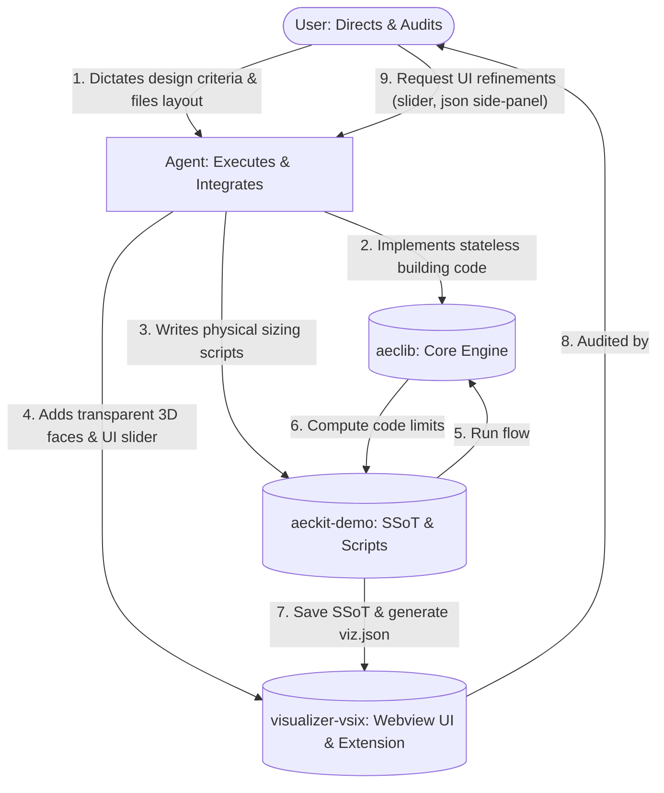
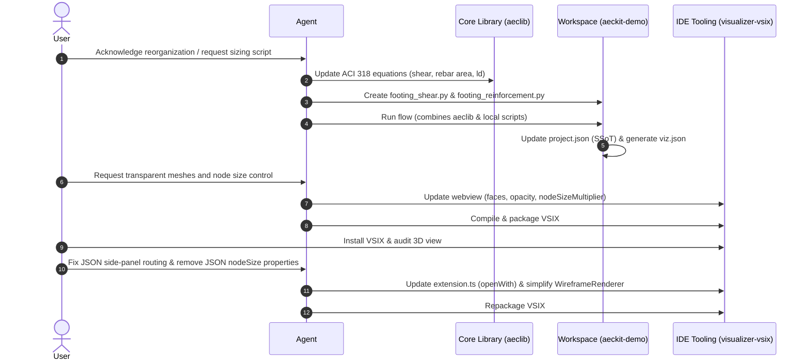

# Iterative, Multi-Repository Pair Programming Workflow

This document explains and diagrams the collaborative development loop used during this project. It outlines how a developer and an AI assistant interact across multiple scopes—core code compliance, local script executions, and extension-level user interfaces.

---

## 1. Explanation of the Workflow

Our workflow represents a **Multi-Tiered Iterative Development Cycle** across three separate code repositories/projects:
1.  **`aeclib` (Shared Core Engine):** Stateless, input-driven building code mathematics and parameters (e.g. ACI 318 limits, ASCE 7 load combinations).
2.  **`aeckit-demo` (Local Workspace):** Physical design scripts (`footing_shear.py`, etc.), pipeline workflows, and the JSON Single Source of Truth (SSoT).
3.  **`visualizer-vsix` (IDE Tooling):** Custom 3D rendering engine, UI controls (Node Size slider), and VS Code integration commands.

### The Collaboration Pattern
*   **User Directs Intent & Constraints:** You establish the architectural boundaries (the *Flywheel Effect*), provide design assumptions (nominal 6x6 columns, accidental eccentricity), reorganize workspaces, and audit UI features (e.g. JSON split view panel, concrete mesh transparency).
*   **Assistant Coordinates Cross-Repository Execution:** The AI acts as the execution agent, writing logic in the core library, designing workflow scripts in the local workspace, compiling the extension front-end, and documenting outcomes in tracking issues.
*   **Continuous SSoT Integration:** We verify the designs using dry-run tests and live runs, which automatically update `project.json` and generate THREE.js `.viz.json` files for real-time visualization.

---

## 2. Diagram of the Conversation & Development Loop

The interaction model below represents our conversation loop in a generic sense:

### Detailed Execution Sequence

---

## 3. Generalized Workflow Steps

In a generic sense, this multi-repo pair programming workflow consists of the following sequential phases:

1.  **Scope Alignment & Parameterization:** The developer establishes the goal, designs the database schema (SSoT layout in `project.json`), and aligns on building code requirements vs. physical calculations.
2.  **Core Library Implementation (`aeclib`):** Stateless compliance equations, prescriptive constants, and load combination logic are implemented in the shared core engine to ensure reusability.
3.  **Local Sizing & SSoT Scripting (`aeckit-demo`):** Sizing calculations (such as concrete weight, trapezoidal pressure, and sizing search iterations) are codified in local workspace scripts. These scripts read SSoT inputs, apply the core `aeclib` capacity equations, and return optimized results.
4.  **SSoT Database Update:** Running the design workflow executes the local scripts in sequence, updating the Centralized JSON SSoT with derived dimensions and reinforcement schedules.
5.  **Geometry Rendering Output:** A local visualizer script reads the finalized SSoT data and outputs wireframe coordinates and face meshes to a `.viz.json` file.
6.  **Tooling & Webview Upgrades (`visualizer-vsix`):** The custom 3D editor extension is updated to support rendering of transparent faces (using custom Three.js `BufferGeometry`), draw rebar grids, integrate correct VS Code side-panel text editing views, and introduce interactive UI controls (like the Node Size slider).
7.  **Schema Refinement:** Presentation/rendering properties (like individual `nodeSize` settings) are migrated from the engineering database to the UI toolbar controls to maintain SSoT data purity.

